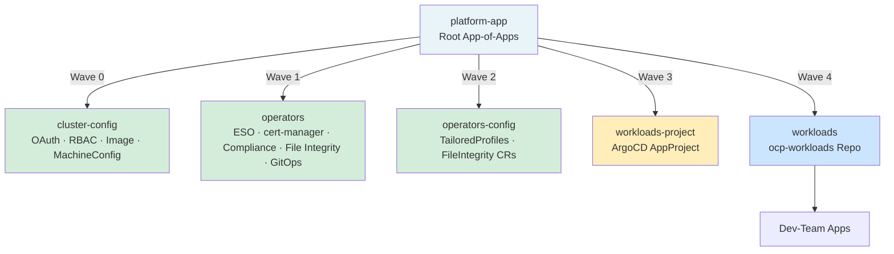
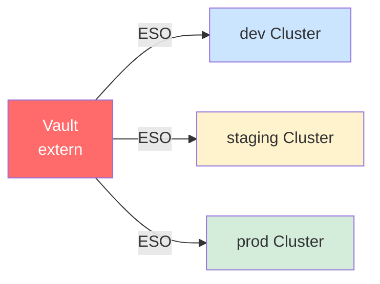

# ocp-platform

GitOps-Plattform für OpenShift basierend auf ArgoCD.

> **Secret Management:** Secrets werden manuell als Bootstrap-Schritt angelegt — Externer Vault + ESO für Produktion (ESO bereits installiert)

---

## Übersicht



---

## Repo-Struktur

```
ocp-platform/
├── bootstrap/                        # Einmalig manuell ausführen
│   ├── README-initial-setup.md       # Detaillierte Bootstrap-Anleitung
│   ├── platform-project.yaml         # ArgoCD AppProject: platform
│   ├── platform-app.yaml             # Root App-of-Apps
│   └── gitops-operator/              # GitOps Operator Bootstrap
│       ├── namespace.yaml
│       ├── operatorgroup.yaml
│       └── subscription.yaml
├── apps/                             # Child-Apps (von platform-app verwaltet)
│   ├── cluster-config-app.yaml       # Wave 0
│   ├── operators-app.yaml            # Wave 1
│   ├── operators-config-app.yaml     # Wave 2
│   ├── workloads-project.yaml        # Wave 3
│   └── workloads-app.yaml            # Wave 4
├── cluster-config/                   # Cluster-Konfiguration
│   ├── console/                      # MOTD, Banner
│   ├── image/                        # Allowed Registries
│   ├── machineconfig/                # SSH Hardening
│   ├── oauth/                        # HTPasswd Identity Provider
│   └── rbac/                         # Admin ClusterRoleBinding
├── operators/                        # Operator Installationen
│   ├── cert-manager/
│   ├── compliance-operator/
│   ├── file-integrity-operator/
│   ├── openshift-external-secrets-operator/
│   └── openshift-gitops-operator/
└── operators-config/                 # Operator CRs (nach Operator-Installation)
    ├── compliance/                   # TailoredProfiles, ScanSettingBinding
    └── file-integrity/               # FileIntegrity CRs
```

---

## Sync Wave Reihenfolge

Sync Waves steuern die Deploy-Reihenfolge innerhalb einer App. Da Waves nur innerhalb einer App funktionieren, sind Operator-Installation und Operator-Konfiguration bewusst in separate Apps aufgeteilt.

| Wave | App | Inhalt | Abhängigkeit |
|------|-----|--------|-------------|
| `0` | cluster-config | OAuth, RBAC, Image, MachineConfig, Console | Keine |
| `1` | operators | Alle Operator Subscriptions | Wave 0 abgeschlossen |
| `2` | operators-config | TailoredProfiles, FileIntegrity CRs | Operators müssen laufen |
| `3` | workloads-project | ArgoCD AppProject für Workloads | Wave 2 abgeschlossen |
| `4` | workloads | App-Registrierungen aus ocp-workloads | AppProject muss existieren |

---

## Secret Management

### CRC: Manuell

Secrets werden beim Bootstrap einmalig manuell angelegt und sind nicht in Git gespeichert.

| Secret | Namespace | Inhalt |
|---|---|---|
| `htpasswd-secret` | openshift-config | Admin User Passwort-Hash |

### Produktion: Externer Vault + ESO

ESO ist bereits installiert — für Produktion wird nur ein `ClusterSecretStore` konfiguriert der auf den externen Vault zeigt.



---

## Installierte Operators

| Operator | Namespace | Zweck | InstallPlan CRC | InstallPlan Prod |
|---|---|---|---|---|
| OpenShift GitOps | openshift-gitops-operator | ArgoCD | Automatic | Manual |
| ESO | openshift-external-secrets-operator | Secret Management (Prod) | Automatic | Manual |
| cert-manager | cert-manager-operator | TLS Zertifikate | Automatic | Manual |
| Compliance Operator | openshift-compliance | CIS/NIST Compliance | Automatic | Manual |
| File Integrity Operator | openshift-file-integrity | Datei-Integrität | Automatic | Manual |

---

## Bootstrap

Siehe [bootstrap/README-initial-setup.md](bootstrap/README-initial-setup.md) für die vollständige Installationsanleitung.

**Kurzübersicht:**

```bash
# 1. GitOps Operator installieren
oc apply -f bootstrap/gitops-operator/

# 2. HTPasswd Secret anlegen
oc create secret generic htpasswd-secret \
  --from-literal=htpasswd='admin:<bcrypt-hash>' \
  -n openshift-config

# 3. Gruppe und Bootstrap
oc adm groups new cluster-admins
oc adm groups add-users cluster-admins admin
oc apply -f bootstrap/platform-project.yaml
oc apply -f bootstrap/platform-app.yaml
```

---

## Weiterführendes

- [bootstrap/README-initial-setup.md](bootstrap/README-initial-setup.md) — Detaillierter Bootstrap-Prozess
- [ocp-workloads](https://github.com/chriwo42-lang/ocp-workloads) — Workloads Repo
