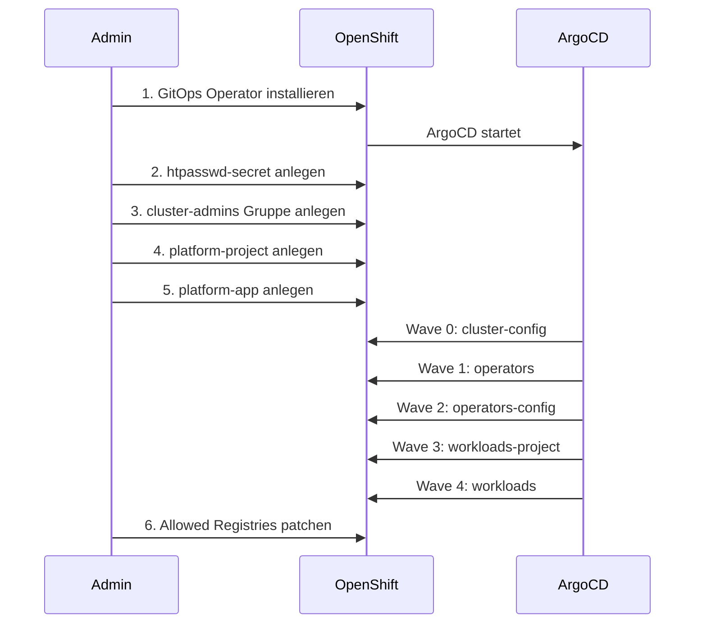

# Bootstrap – Initiales Setup

Dieses Dokument beschreibt alle manuellen Schritte die **einmalig** ausgeführt werden müssen, bevor ArgoCD den Rest automatisch übernimmt.

---

## Voraussetzungen

- OpenShift Local (CRC) läuft: `crc status`
- `oc` CLI installiert und verfügbar
- Als `kubeadmin` eingeloggt:

```bash
crc console --credentials
oc login -u kubeadmin https://api.crc.testing:6443
```

---

## Bootstrap-Ablauf



---

## Schritt 1 – GitOps Operator installieren

```bash
oc apply -f bootstrap/gitops-operator/
```

Warten bis ArgoCD bereit ist:

```bash
oc get pods -n openshift-gitops -w
```

Alle Pods müssen `Running` sein bevor weitergemacht wird.

---

## Schritt 2 – HTPasswd Secret anlegen

BCrypt Hash generieren (Rounds: 10): https://bcrypt-generator.com

```bash
oc create secret generic htpasswd-secret \
  --from-literal=htpasswd='admin:<bcrypt-hash>' \
  -n openshift-config
```

---

## Schritt 3 – cluster-admins Gruppe anlegen

```bash
oc adm groups new cluster-admins
oc adm groups add-users cluster-admins admin
```

---

## Schritt 4 – Platform Project anlegen

```bash
oc apply -f bootstrap/platform-project.yaml
```

---

## Schritt 5 – Root App-of-Apps anlegen

```bash
oc apply -f bootstrap/platform-app.yaml
```

Ab hier übernimmt ArgoCD alle weiteren Schritte automatisch.

---

## Schritt 6 – Allowed Registries setzen (manuell)

Die `Image` CR ist `create-only` und kann nicht über ArgoCD aktualisiert werden.

```bash
oc patch image.config.openshift.io cluster --type merge -p \
  "{\"spec\":{\"registrySources\":{\"allowedRegistries\":[\"registry.redhat.io\",\"registry.access.redhat.com\",\"registry.connect.redhat.com\",\"quay.io\",\"docker.io\",\"image-registry.openshift-image-registry.svc:5000\"]},\"allowedRegistriesForImport\":[{\"domainName\":\"registry.redhat.io\"},{\"domainName\":\"registry.access.redhat.com\"},{\"domainName\":\"registry.connect.redhat.com\"},{\"domainName\":\"quay.io\"},{\"domainName\":\"docker.io\"}]}}"
```

---

## Bekannte Probleme nach Neustart

**Operator Subscriptions nicht healthy:**

```bash
oc annotate subscription <n> -n <namespace> \
  olm.operatorframework.io/force-update=$(Get-Date -UFormat %s) --overwrite
```

**Compliance Scan neu auslösen:**

```bash
oc annotate compliancescan ocp4-moderate-tailored \
  rhcos4-moderate-tailored-master \
  rhcos4-moderate-tailored-worker \
  -n openshift-compliance \
  compliance.openshift.io/rescan=true
```
